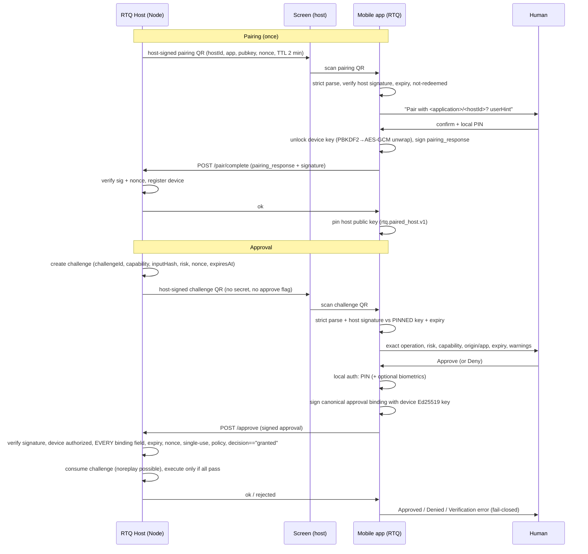

# RTQ Mobile Approval

The RTQ Mobile Approval app (`apps/rtq-mobile`) is a Flutter client that lets a
human make **one decision**: approve or deny a specific, cryptographically
bound action proposed by an RTQ host. The app is **never the authorization
authority** — it produces a signed approval and the host independently verifies
everything before anything executes.

This document covers architecture, the protocol, pairing, QR transport, the
approval flow, PIN/biometric local verification, keys, replay protection,
revocation, the threat model, testing, and known limitations. Every security
claim is tied to the source file and test that demonstrate it (see
[Verification & evidence](#verification--evidence) for exact results and what
is and is not yet backed by commits/CI).

---

## 1. Trust model in one paragraph

The host shows a **challenge** QR. Scanning the QR grants nothing — the payload
contains no secret and never contains an approval. The human reviews exactly
what the challenge proposes (operation, risk, capability, target, origin,
application, expiry), proves a local possession factor (PIN, optionally plus
biometrics), and the app signs the **challenge binding** with a device-held
Ed25519 key. The signed approval travels to the host over a separate,
untrusted transport. The host then independently verifies the signature, the
device's authorization, the challenge binding field-by-field, expiry, nonce,
single-use consumption, and policy — and only then executes. A PIN is never
transmitted; a private key never leaves the device; a captured approval cannot
be replayed.

---

## 2. Architecture

### 2.1 Layers and responsibilities

| Layer                     | Location                 | Responsibility                                                                       |
| ------------------------- | ------------------------ | ------------------------------------------------------------------------------------ |
| Protocol core (pure Dart) | `lib/protocol/`          | strict JSON, canonical JSON, base64url, Ed25519, models, encode/parse/sign/verify    |
| QR classification         | `lib/qr/qr_payload.dart` | recognize `rtq://` challenge / pairing / approval payloads; everything else rejected |
| Security                  | `lib/security/`          | PIN-wrapped device key (PBKDF2 + AES-256-GCM), biometric gate, secure storage        |
| Pairing                   | `lib/pairing/`           | host-signed pairing QR → review → sign response → submit → pin host key              |
| Approval                  | `lib/approval/`          | fail-closed state machine over every required UI state                               |
| Transport                 | `lib/transport/`         | submits signed results to the host; untrusted channel; never carries PIN/key         |
| UI                        | `lib/ui/`                | one dedicated screen per state; the view layer holds no security logic               |
| Composition root          | `lib/main.dart`          | wires real implementations (FlutterSecureStorage, local_auth, HTTP)                  |

### 2.2 Host side (reference implementations)

| Concern                                                         | Location                                                        |
| --------------------------------------------------------------- | --------------------------------------------------------------- |
| Wire models + canonical signing bodies                          | `packages/approval/src/protocol.ts`                             |
| Approval verifier (granted-only, replay/single-use)             | `packages/approval/src/approval-v1.ts`                          |
| Device registry, revocation, pairing manager                    | `packages/approval/src/device.ts`                               |
| Host HTTP service (`/pair/start`, `/pair/complete`, `/approve`) | `packages/mobile/src/service.ts`, `packages/mobile/src/http.ts` |
| Shared test vectors (Node-generated)                            | `protocol/rtq-approval-v1.vectors.json`                         |

### 2.3 Dependency direction

The Dart app mirrors the Node host's wire rules **exactly**; they are pinned
against each other by shared test vectors (section 8.1). The app depends on no
internal of the host and the host depends on no code from the app.

---

## 3. Protocol — `rtq-approval-v1`

Both implementations speak one protocol, versioned `rtq-approval-v1` (version
`1`), defined in `packages/approval/src/protocol.ts` and mirrored in
`lib/protocol/protocol.dart`.

### 3.1 QR envelope

```
rtq://challenge?v=1&c=<base64url(canonical JSON)>
rtq://pair?v=1&c=<base64url(canonical JSON)>
rtq://approval?v=1&c=<base64url(canonical JSON)>   (result transport, never scanned by this app)
```

- `v=1` — the only supported version; any other version is rejected.
- `c=` — canonical base64url (RFC 4648 §5, no padding). The parser re-encodes
  the decoded bytes and rejects any input that does not re-encode identically
  (padding, alternate alphabet characters, aliased encodings all fail).
- The JSON inside is parsed with a **strict, duplicate-key-rejecting parser**
  (`lib/protocol/strict_json.dart` and `packages/crypto/src/strict-json.ts`) so
  the Dart host-even-and-device can never disagree about what a payload means.

### 3.2 Canonical JSON

Signing bodies are `canonicalStringify` output: recursively sorted keys,
standard JSON escapes, integers printed without decimals, non-finite numbers
rejected. Implemented identically in `lib/protocol/canonical.dart` and
`packages/crypto/src/canonical.ts`. Ed25519 (RFC 8032) is deterministic, so
re-signing the same body anywhere produces the **same bytes**.

### 3.3 Challenge (host → device)

Signed by the host's Ed25519 key. Verification in
`lib/protocol/protocol.dart` (`verifyHostSignature`) checks the signature
against the **pinned** host public key — a challenge claiming any other host
key is `hostMismatch` and is rejected before anything else is shown.

### 3.4 Approval (device → host)

The device signs the canonical `approvalSigningBody` — see
`packages/approval/src/protocol.ts:214` and `RtqSignedApproval.signingBody()`
in `lib/protocol/models.dart`. The binding captures every material field:

```
protocol, version, kind:"approval",
challenge:{challengeId, capability, capabilityVersion, inputHash,
          risk, origin, application, hostId, policyVersion, expiresAt, nonce},
decision, deviceId, signedAt  + Ed25519 signature
```

The host verifier (`packages/approval/src/approval-v1.ts`) compares the
binding **field by field** against its own challenge record and denies on any
mismatch (see the mismatch table in that file, e.g. `["nonce", expected,
actual]`). A decision other than `granted` is a denial
(approval-v1.ts:211); the app itself submits `denied` when the human denies.

### 3.5 Strictness and failure codes

Malformed, unsupported, duplicate-key, tampered-signature, host-mismatch,
expired, and consumed challenges each map to a stable error code
(`lib/protocol/errors.dart`) that the UI shows. The app fails **closed** on
every one of these paths — there is no partial-accept state.

---

## 4. Keys

| Item                   | Property                                                                                                             |
| ---------------------- | -------------------------------------------------------------------------------------------------------------------- |
| Device seed            | 32 random bytes from `cryptography`'s CSPRNG, generated once at setup (`lib/security/device_key_vault.dart::create`) |
| Device Ed25519 keypair | derived from the seed; public half sent to the host during pairing                                                   |
| `deviceId`             | `sha256(raw 32-byte public key)` hex — stable public fingerprint, shared at pairing                                  |
| Device public key JWK  | `{kty:"OKP", crv:"Ed25519", x}` sent inside the signed pairing response                                              |
| Seed at rest           | AES-256-GCM wrapped by a KEK derived from the PIN via PBKDF2-HMAC-SHA256 (210,000 iterations, random 16-byte salt)   |
| Seed in memory         | present only while unlocked for a single signing; never logged, never written to disk                                |
| Host key               | pinned at pairing from the host-signed QR; challenge QRs are verified against this pin                               |
| Host signature         | Ed25519 over the challenge's canonical signing body — verified before display                                        |

Nothing derived from the PIN is ever persisted (section 6). The vault record
contains `iterations, salt, nonce, ciphertext, mac, publicKey` only —
`test/security/device_key_vault_test.dart` asserts no PIN or seed text appears
in the stored record.

---

## 5. Pairing

Pairing establishes the trust anchor. It requires **explicit human
confirmation** and is single-use.

1. The host creates a short-lived, host-signed pairing QR
   (`createPairingChallengeV1`, TTL 2 min) containing `hostId`, `application`,
   `userHint`, `hostPublicKey`, `nonce`, `expiresAt`.
2. The app parses strictly, verifies the host signature, checks expiry and
   that the device is not already paired with that host (`pairingRedeemed`).
3. The human reviews the host (application, host ID, user hint), enters the
   local PIN to unlock the device key, and confirms.
4. The app signs a `pairing_response` (`pairingId`, `hostId`, `nonce`,
   `deviceId`, `deviceName`, `publicKeyJwk`, `signedAt`) and submits it over
   `/pair/complete`.
5. The host verifies the signature + nonce, records the device, and the app
   persists the pinned host record (`rtq.paired_host.v1`). The same QR cannot
   redeem twice.

Because the host key comes from a **signed** pairing QR and is pinned, a later
(challenge) QR can never silently change the trust anchor. Re-pairing to a new
host, unpairing, and wiping are explicit management actions in the Status tab
(`lib/ui/status/status_screen.dart`).

See `docs/mobile-approval/aartiq-migration.md` for why this differs from
Aartiq's PIN-in-the-deep-link pattern.

---

## 6. PIN and biometrics — local verification only

### 6.1 PIN

- Chosen at setup (policy: 6–64 digits, no single repeated digit, no ±1
  sequence — `PinPolicy` in `lib/security/device_key_vault.dart`).
- Used only to derive the AES-GCM key-encryption key via
  PBKDF2-HMAC-SHA256(210000). The KEK is ephemeral and never stored.
- Unlock happens in memory, for one signing, then the key is forgotten
  (vault state is not cached across operations).
- The PIN is **never** sent, stored in plaintext, logged, printed in a QR, or
  included in any approval or pairing payload. `approval_controller.dart`
  state this invariant and `test/approval/*` verify a wrong PIN can never
  produce a signature.

### 6.2 Biometrics

Optional second gate behind the PIN via `local_auth`
(`lib/security/local_auth_biometric_gate.dart`). The gate is an abstraction
with an in-memory fake for headless tests; the platform implementation fails
closed — unavailable, cancelled, locked-out, or any platform error maps to a
failed attempt, which the controller treats as a denial. Biometrics never
replace PIN possession.

---

## 7. QR transport separation

The **challenge** travels by QR (out-of-band from the result channel); the
**signed approval result** travels over the HTTP transport. This is not a
trust boundary — the channel is assumed hostile — it is a separation of
concerns: scanning a QR can never authorize anything, because the QR is only a
signed _request_. `approve=true`-style payloads do not exist in this protocol;
the only machine-readable thing a QR can carry is a challenge or pairing
request, both host-signed.

The HTTPS/localhost note from `docs/THREAT_MODEL.md` applies: the network hop
is irrelevant to the decision — the host verifies cryptographically.

---

## 8. Testing

### 8.1 Cross-implementation vectors

`protocol/rtq-approval-v1.vectors.json` is generated by the TypeScript
implementation (`tests/protocol/generate-vectors.test.ts`, gated by
`RTQ_WRITE_VECTORS=1`) and consumed byte-for-byte by Dart:
`test/protocol/protocol_vectors_test.dart`. It pins:

- canonical stringify examples,
- a host-signed challenge: QR parse, signature verify, canonical signing body,
- device approvals (granted + denied, deviceA/deviceB): **re-signing in Dart
  must reproduce the exact Node signature bytes**, and the vector JSON must
  parse and verify,
- a host-signed pairing QR + device pairing response (exact re-sign + verify).

Because Ed25519 is deterministic, this is a genuine equality test between the
two implementations.

### 8.2 Suites

- `flutter analyze` — zero issues.
- `flutter test` — 85 test cases pass: protocol units, vectors, vault (PIN
  policy, wrapping, re-wrapping on PIN change, wipe), approval controller
  (every failure mode + happy path with binding integrity), pairing controller
  (tamper, expiry, replay, setup-required, host rejection), transport
  (endpoint shapes, failure codes, timeout, connection error).
- TypeScript side: `npm run test:mobile` runs `tests/mobile` + `tests/protocol`
  against the same wire rules and reproduces the vectors.

### 8.3 What fakes stand in for

`InMemorySecureStore` and `FakeBiometricGate` / `FakeApprovalTransport` make the
state machines testable headlessly. The production wiring
(`FlutterSecureStore`, `LocalAuthBiometricGate`, `HttpApprovalTransport`)
replace them only in `lib/main.dart`.

---

## 9. Sequence diagram



### 9.1 ASCII fallback

```
Host            Screen          Mobile app            Human
 |--pair QR------>|               |                    |
 |                 |---scan------->|                    |
 |                 |               |--parse+verify sig->| (strict)
 |                 |               |<--confirm+PIN------|
 |                 |               |--sign response---->|  POST /pair/complete
 |<--register+ok---|               |                    |
 |                 |               |--pin host key------|
 |                 |               |                    |
 |--challenge QR-->|               |                    |
 |                 |---scan------->|                    |
 |                 |               |--verify vs pin---->|
 |                 |               |<--brief+review-----|  Approve/Deny
 |                 |               |--local auth(PIN)-->|
 |                 |               |--sign approval---->|  POST /approve
 |<--verify all-----|               |                    |
 |   execute only   |               |                    |
```

---

## 10. Replay, single-use, revocation

- **Single-use**: the host consumes the challenge on first presentation
  (`approval-v1.ts` — "challenge already redeemed (replay)"). A captured
  approval cannot be replayed; the binding also ties it to the exact challenge
  fields.
- **Nonce**: binds the challenge (and pairing) to one host transaction; the
  host compares it inside the verifier.
- **Expiry**: challenge TTL 5 min, pairing TTL 2 min, clock skew allowance
  `CLOCK_SKEW_MS_V1`; the device also re-checks expiry at signing time
  (fail-closed if the human takes too long — covered by
  `test/approval/approval_controller_test.dart` "challenge expiring
  mid-review").
- **Revocation**: the host's `DeviceRegistry` records `authorized` / `revoked`
  and marks device-authorization checks inside the verifier; the app can also
  wipe its key and unpair locally (Status tab), after which it can no longer
  produce valid approvals.

---

## 11. Threat model

| #   | Threat                                                    | Mitigation                                                                                                                       |
| --- | --------------------------------------------------------- | -------------------------------------------------------------------------------------------------------------------------------- |
| T1  | Stolen/replayed QR grants something                       | QR carries only a signed challenge; signature + single-use + expiry on host                                                      |
| T2  | Attacker swaps host key mid-viewing                       | host key pinned at pairing; challenge signature verified against the pin (`hostMismatch`)                                        |
| T3  | Malicious QR with approve inside                          | protocol has no `approve=` field; unknown fields/kinds rejected                                                                  |
| T4  | PIN sniffing / in-transit PIN                             | the transport API (`lib/transport/approval_transport.dart`) has no PIN/secret parameters; the PIN only unwraps the on-device key |
| T5  | Private key exfiltration                                  | seed wrapped with PBKDF2+AES-GCM; unlock is in-memory and per-signing                                                            |
| T6  | Shoulder-surfing UI hides details                         | details screen shows operation, risk, capability, target, origin, app, expiry, bindings, destructive warnings; no info hidden    |
| T7  | Replayed approval                                         | challenge consumed after first use; binding + nonce + expiry verified                                                            |
| T8  | Wrong-action approval (attacker swaps challenge mid-flow) | binding verifies every field against the host's record, not just the ID                                                          |
| T9  | Device loses trust context                                | wipe/unpair local; host-side revocation record                                                                                   |
| T10 | Time-of-check/time-of-use expiry bypass                   | device re-checks expiry at signing; host enforces independently                                                                  |
| T11 | Duplicate JSON key confusion                              | strict duplicate-rejecting parsers on both sides                                                                                 |
| T12 | Transport failure silently "succeeds"                     | fail-closed connection/verification error; denial path never claims approval                                                     |

---

## 12. Limitations (stated honestly)

- **No hardware-backed key attestation yet**: the seed is wrapped with
  PBKDF2+AES-GCM in secure storage; on Android this lives in Keystore/`flutter_secure_storage`, on iOS in the Keychain, but the app does **not** yet attest to a TEE/SE, so a compromised OS is out of scope.
- **iOS build is not verified in this repository's CI** (no macOS/Xcode
  signing setup). `flutter analyze`/`flutter test` cover the shared code; the
  Android debug APK is built in CI.
- **Camera is optional**: a paste-QR fallback exists (useful when the host
  screen is the phone). Pasting goes through the same strict parser.
- **Clock skew** is handled by the host's allowed skew; devices with a wildly
  wrong clock rely on the host's authoritative check.
- **Biometrics** depend on the platform's enrollment state and fail closed
  when unavailable.

---

## 13. Verification & evidence

All claims above are demonstrated by the files linked in each section. This
repository branch has **no commits yet** (everything is untracked), so there
are no commit SHAs and no CI runs to cite — nothing here claims otherwise.
The following was verified **locally** on this machine at the time of writing:

| Check                                                 | Result                                                  |
| ----------------------------------------------------- | ------------------------------------------------------- |
| `dart analyze` (apps/rtq-mobile)                      | 0 issues                                                |
| `dart format --set-exit-if-changed` (apps/rtq-mobile) | clean                                                   |
| `flutter test` (apps/rtq-mobile)                      | 85/85 pass (incl. protocol vectors byte-exact vs Node)  |
| `npx vitest run tests/mobile tests/protocol`          | pass (43 pass / 1 generator skip; produces the vectors) |
| `npm run test:unit`, `test:security`                  | pass (83 + 23 = 106, pre-existing baseline)             |

When the first commit lands, this table should be extended with the commit SHA
and the GitHub Actions run URLs (`ci.yml`, `mobile.yml`).
